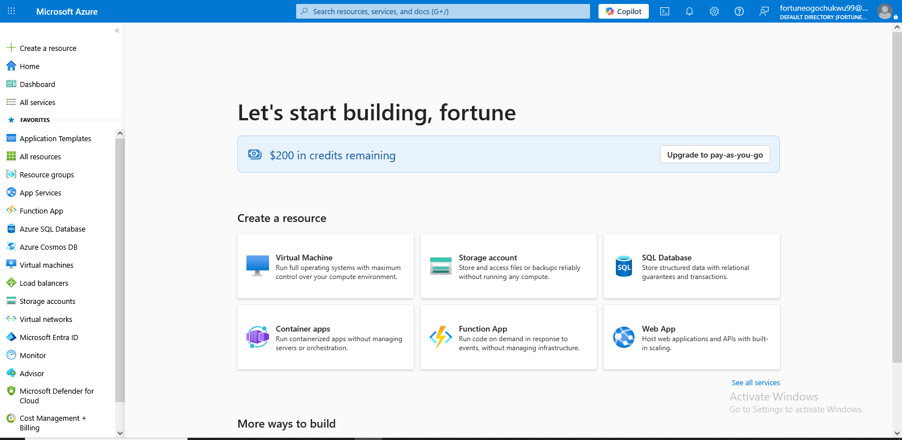
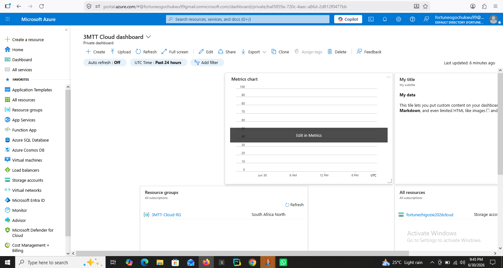
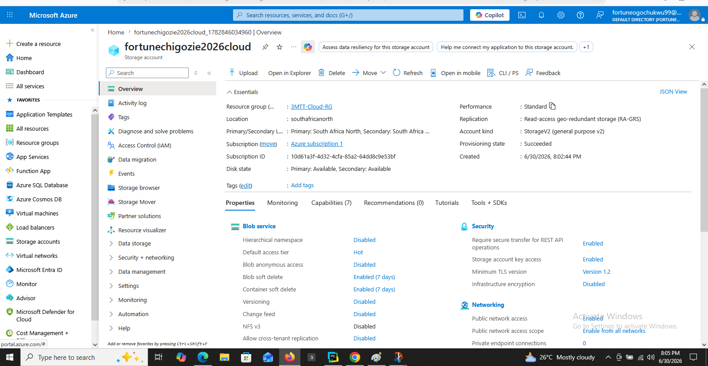

# Azure Free Tier Account Setup Project

## Project Overview

This project demonstrates the successful creation of a Microsoft Azure Free Tier account and the deployment of cloud resources using the Azure Portal.

The objective of this project was to:

- Create a Microsoft Azure Free Tier account.
- Verify the account using email, phone number and payment card.
- Explore the Azure Portal.
- Create a Resource Group.
- Deploy an Azure Storage Account.
- Understand Azure Cost Management and Billing.
- Upload project evidence to GitHub.

---

# Step 1: Creating a Microsoft Azure Free Tier Account

1. Visited the Microsoft Azure website.
2. Clicked *Start Free*.
3. Signed in using a Microsoft account.
4. Verified my email address.
5. Verified my phone number using the OTP code sent by Microsoft.
6. Added a valid payment card for identity verification.
7. Accepted the Microsoft Azure terms and conditions.
8. Successfully activated the Azure Free Tier account.

*Screenshot*

---

# Step 2: Exploring the Azure Portal

After signing in, I explored the Azure Portal.

The Azure Portal provides access to many cloud services including:

- Virtual Machines (Compute)
- Storage Accounts
- Networking
- Databases
- Resource Groups
- Cost Management + Billing
- Microsoft Entra ID

The search bar at the top of the portal can be used to quickly locate any Azure service.

# Step 2A: Creating a Custom Dashboard

To improve monitoring and navigation, I created a custom Azure Dashboard.

Steps followed:

1. Opened the Dashboard service in the Azure Portal.
2. Selected *Create a dashboard*.
3. Named the dashboard *3MTT Cloud Dashboard*.
4. Added useful tiles including:
   - Resource Groups
   - All Resources
   - Metrics Chart
   - Clock
5. Saved the dashboard successfully.

*Screenshot*

# Step 3: Creating a Resource Group

Steps followed:

1. Searched for *Resource Groups*.
2. Selected *Create*.
3. Selected my Azure subscription.
4. Entered the Resource Group name.
5. Selected *South Africa North* as the region.
6. Clicked *Review + Create*.
7. Clicked *Create*.

The Resource Group was successfully deployed.

*Screenshot*

.png)

---

# Step 4: Creating an Azure Storage Account

Steps followed:

1. Searched for *Storage Accounts*.
2. Clicked *Create*.
3. Selected my subscription.
4. Selected the Resource Group.
5. Entered a globally unique Storage Account name.
6. Selected the deployment region.
7. Chose Standard Performance.
8. Selected the replication option.
9. Clicked *Review + Create*.
10. Successfully deployed the Storage Account.

*Screenshot*

---

# Step 5: Microsoft Entra ID

Microsoft Entra ID is Azure's identity and access management service.

It is used to:

- Manage users
- Manage authentication
- Control permissions
- Secure cloud resources

I successfully accessed Microsoft Entra ID and verified my user account.

*Screenshot*

.png)

---

# Step 6: Cost Management and Billing

Azure provides Cost Management tools that help monitor cloud spending.

From the Cost Management + Billing page users can:

- View subscriptions
- Monitor spending
- Create budgets
- Configure billing alerts
- View invoices

*Screenshot*

.png)

---

# Step 7: Creating a Budget Alert

To prevent unexpected charges, I configured a budget alert.

Steps followed:

1. Opened *Cost Management + Billing*.
2. Selected my Azure subscription.
3. Opened *Budgets*.
4. Created a new monthly budget.
5. Configured an alert to trigger at *75%* of the budget.
6. Saved the budget successfully.

*Screenshot*

# Step 8: Multi-Factor Authentication (MFA)

Multi-Factor Authentication provides additional security by requiring another verification method besides a password.

Examples include:

- Microsoft Authenticator App
- SMS verification
- Phone call verification

Using MFA significantly improves account security and is recommended for every Azure account.

---

# Step 9: Azure Free Tier Services

Some Azure Free Tier services include:

| Service | Free Limit |
|----------|------------|
| Virtual Machines | 750 hours |
| Blob Storage | 5 GB |
| Azure SQL Database | 250 GB |
| Functions | 1 Million requests |
| Bandwidth | 15 GB outbound |

---

# Lessons Learned

During this project I learned:

- How to create a Microsoft Azure account.
- How to navigate the Azure Portal.
- How Resource Groups organize Azure resources.
- How to deploy a Storage Account.
- The importance of Cost Management.
- The importance of securing cloud resources using Multi-Factor Authentication.

---

# Conclusion

This project successfully demonstrated the setup of a Microsoft Azure Free Tier account, deployment of Azure resources, navigation of the Azure Portal, and understanding of basic cloud management features.

The screenshots included provide evidence that each task was completed successfully.
